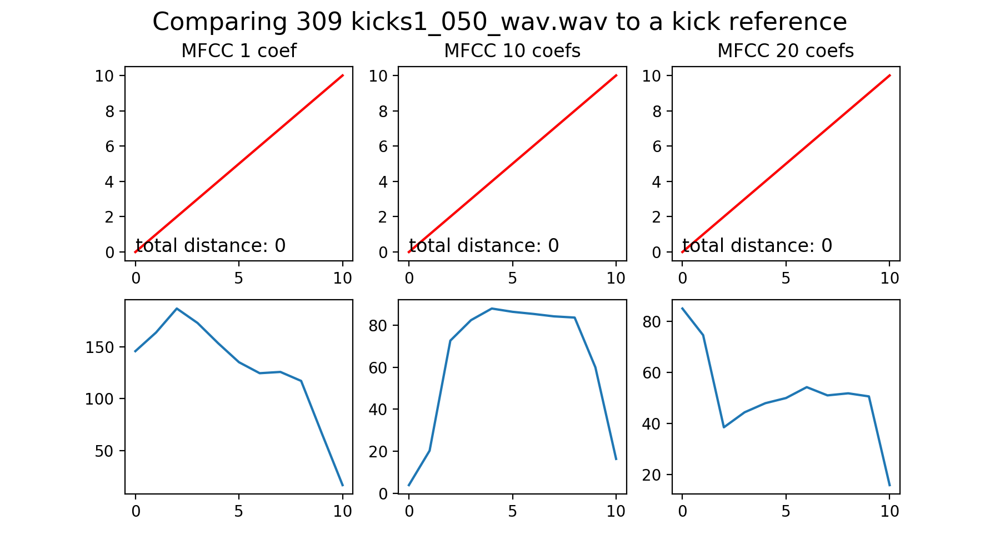

= NOI Librarian
Marián Hlaváč <marian.hlavac@fit.cvut.cz>
v0.5, 2017-12-03
:toc:
:stem: latexmath

Zpráva projektu MI-VMM -- Třídění a kategorizace zvukových samplů 
pro embedded zařízení

Marián Hlaváč, marian.hlavac@fit.cvut.cz

== Popis

Semestrální projekt vychází z nabídky dostupných zadání semestrálních prací
předmětu _MI-VMM_. Z kategorie zadání "Podobnostní vyhledávání v audiu" vychází
z projektu s názvem "Obecná podobnost".

Zadání bylo upraveno na podobnost krátkých zvukových záznamů (samplů) a obecnou
podobnost povyšuje na kategorizaci a třídění těchto samplů. Projekt má pak
reálné využití, jeho výstup bude použit na jednoduchém embedded zařízení.
Dalším požadavkem je tak příprava výstupních dat snadno čitelných takovým 
zařízením.

Projekt byl pojmenován *NOI Librarian*, jelikož bude fungovat jako modul, 
který vytváří knihovnu zvukových samplů pro zmíněné zařízení _NOI Synthesizer_. 
Více informací o projektu lze nalézt na 
https://github.com/noi-synth[GitHubu projektu NOI].

== Způsob řešení

Program bude kategorizovat zvukové samply pomocí porovnávání samplů vůči 
referenčním samplům. Každý sample pak bude kategorizován do kategorie, 
které je nejpodobnější a zároveň získá i vlastnost o tom, s jakou 
pravděpodobností do tého kategorie patří.

Tyto informace budou pak vyneseny na graf (v tomto případě o jedné dimenzi), 
který bude vizualizovat jejich pozici vůči těmto kategoriím. 

Pro jednoduchost jsou jako referenční samply zvoleny tři distinktivní druhy 
zvuků na bicí:

* kick (basový buben)
* snare (virbl)
* hi-hat (hi-hat činel)
 
Všechny tyto informace pak budou uloženy do jednoduchého metadata souboru, 
který bude zařízení číst pro získání informací o knihovně samplů.

Jelikož zařízení prozatím neexistuje, pro účely předmětu MI-VMM bude 
vytvořena HTML simulace tohoto rozhraní, na kterém se budou data zobrazovat. 
Budou čteny stejným způsobem, jako by je četlo zařízení -- z výstupního metadata 
souboru.

=== Možnosti řešení

K provádění zmíněného porovnávání samplů bude sloužit určitá volba algoritmů, 
což je primární předmět experimentální části tohoto projektu.

Obecně se z každého samplu pomocí zvolených deskriptorů vytvoří nějaká 
popisující sekvence, která se navzájem porovná pomocí _DTW_ (Dynamic Time Warping).

Po prozkoumání librosa dokumentace jsem se rozhodl, že prozkoumám deskripci
zvuků pomocí MFCC a transformace na frekvenční domény (k tomu vnitřně librosa
využívá rychlé Fourierovy transformace).

Jelikož se samply liší i tvarem waveformu (křivkou signálu), nabízí se i 
porovnání tohoto tvaru. Takový přístup však vyžaduje složitější úpravu signálu
před jeho porovnáváním, jako např. oříznutí ticha z obou stran.

Ořez z levé strany by však mohl být pomocníkem i při porovnávání popisujících 
sekvencí a opět je to jeden z předmětů experimentu.

=== Experimentální sekce

Po naimplementování MFCC jsem se rozhodl vyzkoušet celý balíček několika samplů
a zhodnotit přesnost.

==== Počet MFCC koeficientů

Librosa ve své metodě pro výpočet MFCC má parametr pro nastavení počtu
vypočtených koeficientů. Zkoumal jsem tento parametr pro nastavení jednoho
koeficientu, deseti koeficientů a maximálního počtu -- dvaceti koeficientů.
Následně jsem si vykresloval křivku DTW, znázorňující optimální cestu warpingu.
Tato křivka mi pak dala informaci o tom, jak se dané sekvence podobají.

Z této křivky jsem pak vždy vypočítal vzdálenost těchto sekvencí, pomocí formule

stem:[dist = x - y]

Pro totožné samply to fungovalo dobře, takže základní kontrola (sanity check) 
prochází. (Na grafu lze vidět červenou lineární křivku x = y)

Pro negativní výsledky (nepodobnost) metoda fungovala také správně, ukázala
kladnou vzdálenost při porovnávání hi-hat samplu a kick samplu.

=== Výběr způsobu řešení

> F2 výběr nejpřesnějšího

== Implementace

Jako jazyk implementace byl zvolen _Python_ s využitím knihovny _librosa_, která
poskytla velmi příjemné a jednoduše použitelné rozhraní pro práci se zvukem.

Aplikace je postavena jako Python knihovna, lze ji i nainstalovat pomocí
manažeru _pip_ a používat z příkazové řádky. Aplikace má jednoduché rozhraní,
podporuje dva příkazy - `maintain` a `server`.

Příkaz `maintain` prohledá složku s knihovnou a vytvoří či upraví soubor 
`libary.noi`, ve kterém jsou uloženy metadata souborů v dané složce.

Příkaz `server` pak spustí jednoduchý webový server se simulací rozhraní 
zařízení, které výše zmíněný soubor vizualizuje.

Je tedy záměrem spustit `maintain` a `server` sekvenčně za sebou.

=== Požadavky na běh

Aplikace nevyžaduje žádný zvláštní hardware nebo velký výpočetní výkon. Jelikož
jsou zkoumány krátké samply, je výpočet údržby knihovny možný prakticky na 
kterémkoliv zařízení, na kterém je možné spouštět Python skripty. 
Jediný požadavek tak lze považovat jako dostupnou operační pamět v řádech 
desítek MB.

Jediné, co výkon stroje ovlivní je rychlost údržby knihovny samplů. Proto je
aplikace od základu navržena tak, aby byla spouštěna na osobním počítači, ne
přímo na embedded zařízení. Je reálné a možné spouštět celou tvorbu knihovny na
zařízení, ale nezdá se to jako praktická volba. Především z pohledu
uživatele -- po otevření nabídky samplů, nebo po spuštění zařízení uživatel 
nechce čekat, než proběhne údržba knihovny. Proto je tento NOI Librarian, 
jako modul, spouštěn v rámci aplikace pro práci s knihovnou na počítači,
a tyto hodnoty se přepočítají pouze jednou, při kopírování nových samplů do 
zařízení z počítače.

=== Příklad výstupu

> F2 hodit tam něco z hotový appky

== Diskuze

> deep learning

=== Budoucí vylepšení

Aplikace by v rozšířené verzi nemusela být omezena na graf o jedné dimenzi a
mohla by porovnávat a kategorizovat samply vůči více referenčním zvukům. 
V takovém případě by však bylo nutné navrhnout efektivní a funkční uživatelské
rozhraní, zobrazující takovou kategorizaci.

To by se mohlo zobrazovat jako běžný seznam, nebo graf po aplikaci pokročilejší 
k-NN klasifikace, která by mohla být pro tento účel v rozšířené verzi ideální.
> o deep learning, uživatelské rozhraní, etc.

== Závěr

== Zdroje

* _Librosa dokumentace_
** https://librosa.github.io
* _Kylemcdonald's Audio Notebooks_
** Zdroj inspirace a rešerše
** https://github.com/kylemcdonald/AudioNotebooks
* _Google Experiment, The Infinite Drum Machine_
** Zdroj inspirace a rešerše
** https://experiments.withgoogle.com/ai/drum-machine

