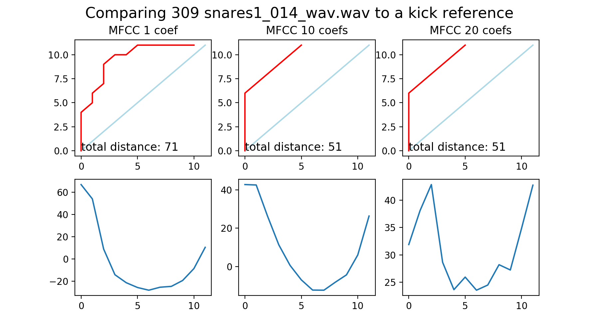
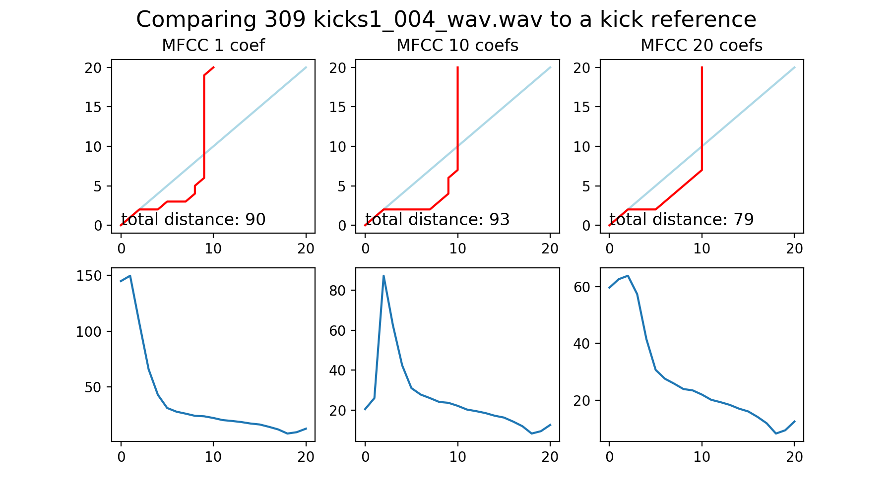
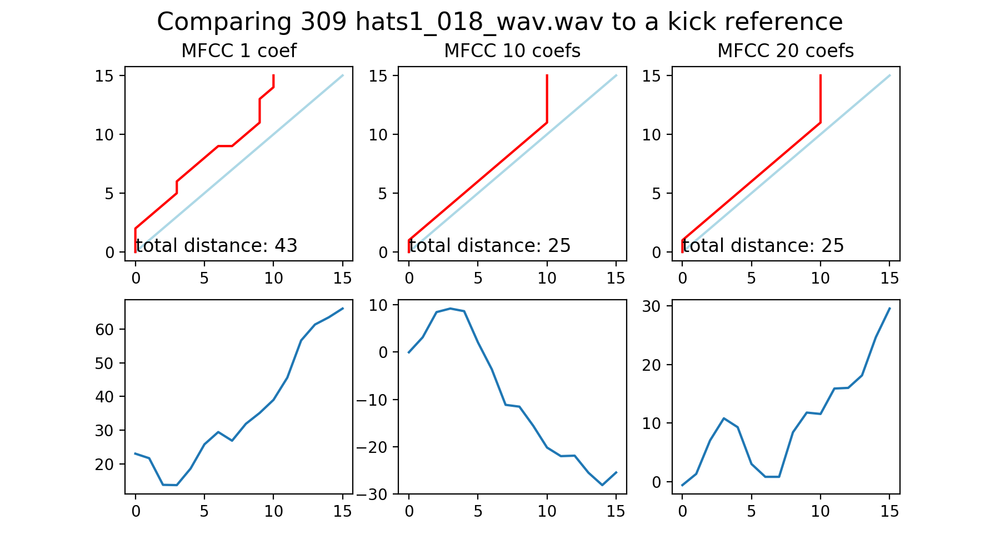
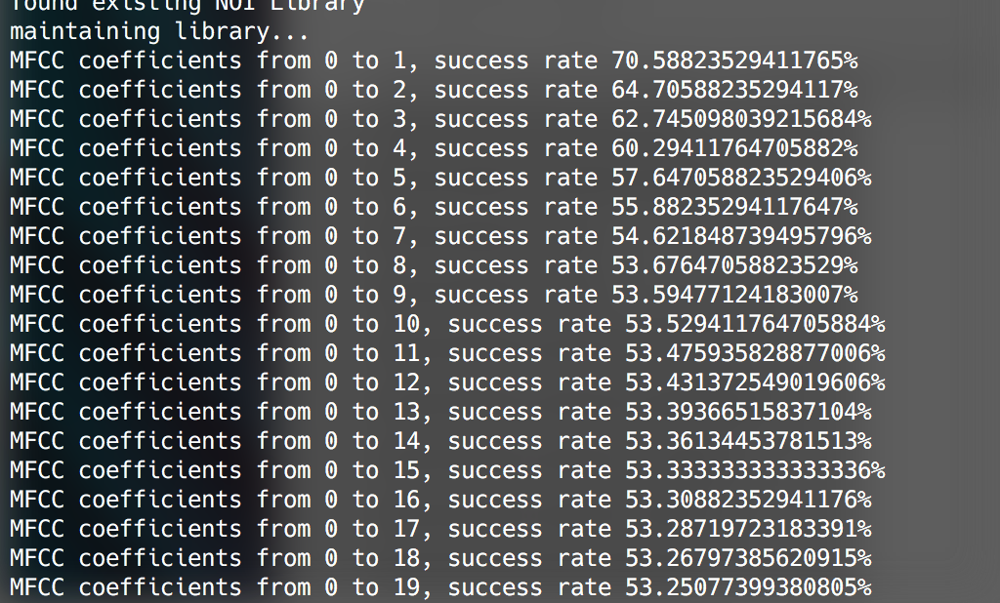
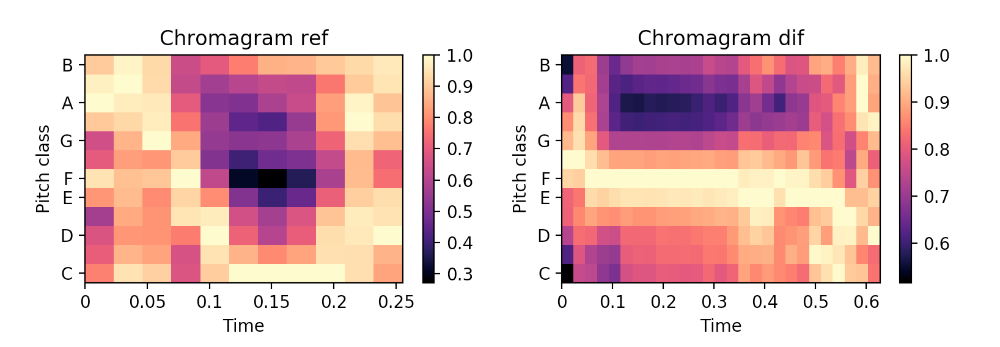
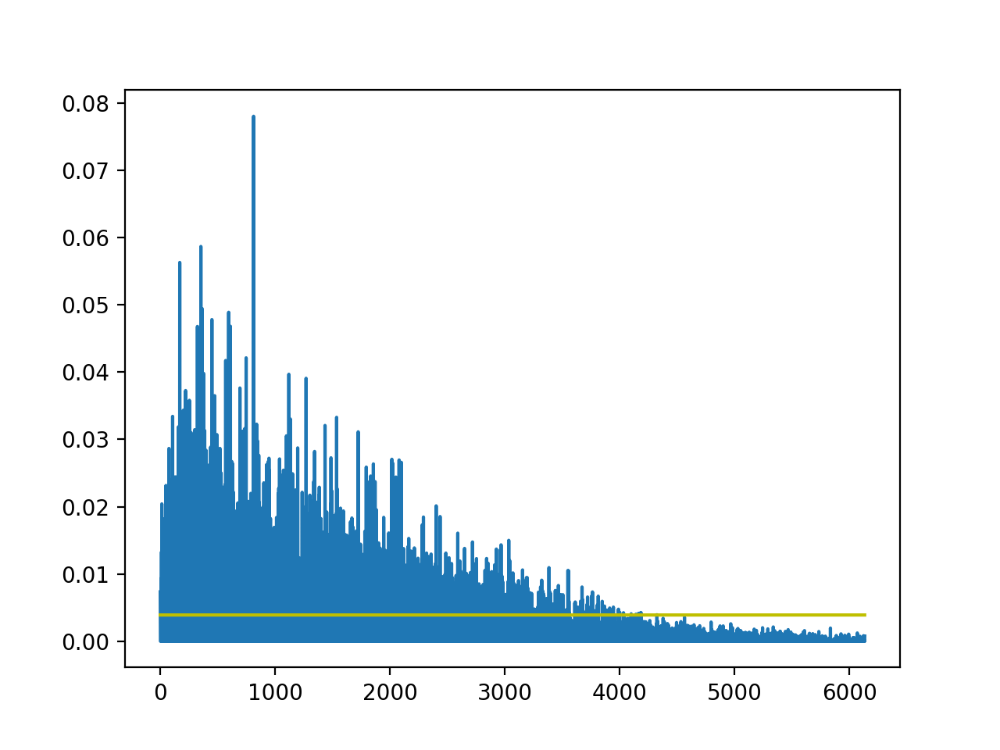
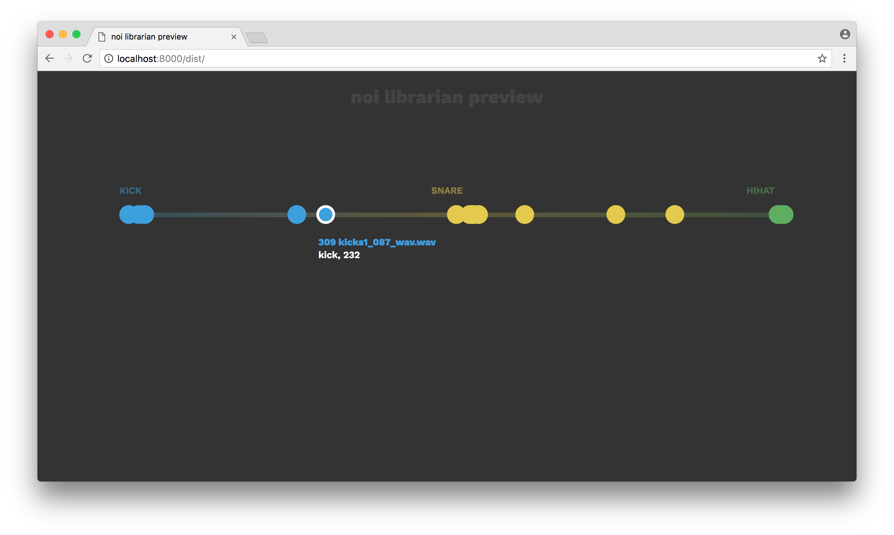

= NOI Librarian
Marián Hlaváč <marian.hlavac@fit.cvut.cz>
v1.0, 2017-12-05
:toc:

Zpráva projektu MI-VMM -- Třídění a kategorizace zvukových samplů 
pro embedded zařízení

Marián Hlaváč, marian.hlavac@fit.cvut.cz

== Popis

Semestrální projekt vychází z nabídky dostupných zadání semestrálních prací
předmětu _MI-VMM_. Z kategorie zadání "Podobnostní vyhledávání v audiu" vychází
z projektu s názvem "Obecná podobnost".

Zadání bylo upraveno na podobnost krátkých zvukových záznamů (samplů) a obecnou
podobnost povyšuje na kategorizaci a třídění těchto samplů. Projekt má pak
reálné využití, jeho výstup bude použit na jednoduchém embedded zařízení.
Dalším požadavkem je tak příprava výstupních dat snadno čitelných takovým 
zařízením.

Projekt byl pojmenován *NOI Librarian*, jelikož bude fungovat jako modul, 
který vytváří knihovnu zvukových samplů pro zmíněné budoucí zařízení 
_NOI Synthesizer_. Více informací o projektu lze nalézt na 
https://github.com/noi-synth[GitHubu projektu NOI].

== Způsob řešení

Program bude kategorizovat zvukové samply pomocí porovnávání samplů vůči 
referenčním samplům. Každý sample pak bude kategorizován do kategorie, 
které je nejpodobnější a zároveň získá i vlastnost o tom, s jakou 
pravděpodobností do tého kategorie patří.

Tyto informace budou pak vyneseny na graf (v tomto případě o jedné dimenzi), 
který bude vizualizovat jejich pozici vůči těmto kategoriím. 

Pro jednoduchost jsou jako referenční samply zvoleny tři distinktivní druhy 
zvuků na bicí:

* kick (basový buben)
* snare (virbl)
* hi-hat (hi-hat činel)
 
Všechny tyto informace pak budou uloženy do jednoduchého metadata souboru, 
který bude zařízení číst pro získání informací o knihovně samplů.

Jelikož zařízení prozatím neexistuje, pro účely předmětu MI-VMM bude 
vytvořena HTML simulace tohoto rozhraní, na kterém se budou data zobrazovat. 
Budou čteny stejným způsobem, jako by je četlo zařízení -- z výstupního metadata 
souboru.

=== Možnosti řešení

K provádění zmíněného porovnávání samplů bude sloužit určitá volba algoritmů, 
což je primární předmět experimentální části tohoto projektu.

Obecně se z každého samplu pomocí zvolených deskriptorů vytvoří nějaká 
popisující sekvence, která se navzájem porovná pomocí _DTW_ 
(Dynamic Time Warping).

Po prozkoumání librosa dokumentace jsem se rozhodl, že prozkoumám deskripci
zvuků pomocí MFCC a transformace na frekvenční domény (k tomu vnitřně librosa
využívá rychlé Fourierovy transformace).

Jelikož se samply liší i tvarem waveformu (křivkou signálu), nabízí se i 
porovnání tohoto tvaru. Takový přístup však vyžaduje složitější úpravu signálu
před jeho porovnáváním, jako např. oříznutí ticha z obou stran.

Ořez z levé strany by však mohl být pomocníkem i při porovnávání popisujících 
sekvencí a opět je to jeden z předmětů experimentu.

=== Experimentální sekce

Po naimplementování MFCC jsem se rozhodl vyzkoušet celý balíček několika samplů
a zhodnotit přesnost.

==== Počet MFCC koeficientů

Librosa ve své metodě pro výpočet MFCC má parametr pro nastavení počtu
vypočtených koeficientů. Zkoumal jsem tento parametr pro nastavení jednoho
koeficientu, deseti koeficientů a maximálního počtu -- dvaceti koeficientů.
Následně jsem si vykresloval křivku DTW, znázorňující optimální cestu warpingu.
Tato křivka mi pak dala informaci o tom, jak se dané sekvence podobají.

Z této křivky jsem pak vždy vypočítal vzdálenost těchto sekvencí, pomocí formule

`dist = x - y`

Pro totožné samply to fungovalo dobře, takže základní kontrola (sanity check) 
prochází. (Na grafu lze vidět červenou lineární křivku x = y)

Pro negativní výsledky (nepodobnost) metoda fungovala také správně, ukázala
kladnou vzdálenost při porovnávání hi-hat samplu a kick samplu. 
(Světle modrá je x = y.)

Při porovnávání zvuků, které měly spadat do stejné kategorie, však úspěchu
dosaženo nebylo. Všechny různé počty koeficientů uváděly vzdálenost kicku od
jiného kicku větší, než například vzdálenost od hi-hatu. Při poslechu však
bylo jasné, že jde skutečně o různé zvuky a kick na kick je skutečně podobný.

Vyzkoušel jsem úspěšnost zařazení do správné kategorie na mém malém vzorku
zvuků podle toho, kolik koeficientů zvolím. Ukázalo se, že čím více koeficientů
je uvažováno, tím větší chyba zařazení je.

Zkoušel jsem různé varianty tohoto zkoumání, i jednotlivé koeficienty, či jejich
podskupiny. Nepodařilo se dosáhnout větší přesnosti, než 70%.

=== Odhad z chromagramů

Librosa nabízí i snadno přístupný výpočet chromagramů pro dané zvuky.
Chromagram vychází z dat, kdy je zvuk rozkategorizován do několik 
"výškových tříd" (tzv. pitch classes) a těmto třídám je pak ke každému zvuku
uvedeno v kterém časovém úseku do které třídy jak moc spadá.

Těmito daty jsme tak schopní popsat různé výšky i hloubky v určitých částech
zvukového samplu.

Předpokládal jsem, že společně s MFCC se zvýší přesnost na téměr bezchybnou, 
bohužel tak dobrého výsledku jsem se nedočkal. Chromagramy trpěly zase jinými
problémy, kterými MFCC netrpí. Většinu z těchto problému nejde popsat, ale
především slyšet.

=== Ořez zleva

Pro přesnější výpočty jsem stanovil hranici amplitudy a prováděl ořez zleva,
aby byly DTW porovnání přesnější a zachytili jsme skutečně sample od svého
začátku.

Hodnotu hranice jsem zvolil jako `max_amplituda * 0.05`.

=== Výběr způsobu řešení

Protože MFCC obecně podávalo lepší výsledek, než chromagramy, rozhodl jsem se
počítat vzdálenost pomocí obou metod, a MFCC přidělit dvounásobnou váhu.

Vzdálenost je tak počítána pomocí:

`distance = (2 * mfcc_distance + chroma_distance) / 3`

Díky tomu se využilo nedokonalého výsledku z MFCC metody a setřelo se několik
rozdílů díky dat z chromagramů.
Výsledná přesnost se však pohybuje kolem 75%, což stále není příliš ideální.

== Implementace

Jako jazyk implementace byl zvolen _Python_ s využitím knihovny _librosa_, která
poskytla velmi příjemné a jednoduše použitelné rozhraní pro práci se zvukem.

Aplikace je postavena jako Python knihovna, lze ji i nainstalovat pomocí
manažeru _pip_ a používat z příkazové řádky. Aplikace má jednoduché rozhraní,
podporuje dva příkazy - `maintain` a `server`.

Příkaz `maintain` prohledá složku s knihovnou a vytvoří či upraví soubor 
`libary.noi`, ve kterém jsou uloženy metadata souborů v dané složce.

Příkaz `server` pak spustí jednoduchý webový server se simulací rozhraní 
zařízení, které výše zmíněný soubor vizualizuje.

Je tedy účelné spustit `maintain` a `server` za sebou.

=== Požadavky na běh

Aplikace nevyžaduje žádný zvláštní hardware nebo velký výpočetní výkon. Jelikož
jsou zkoumány krátké samply, je výpočet údržby knihovny možný prakticky na 
kterémkoliv zařízení, na kterém je možné spouštět Python skripty. 
Jediný požadavek tak lze považovat jako dostupnou operační pamět v řádech 
desítek MB.

Jediné, co výkon stroje ovlivní je rychlost údržby knihovny samplů. Proto je
aplikace od základu navržena tak, aby byla spouštěna na osobním počítači, ne
přímo na embedded zařízení. Je reálné a možné spouštět celou tvorbu knihovny na
zařízení, ale nezdá se to jako praktická volba. Především z pohledu
uživatele -- po otevření nabídky samplů, nebo po spuštění zařízení uživatel 
nechce čekat, než proběhne údržba knihovny. Proto je tento NOI Librarian, 
jako modul, spouštěn v rámci aplikace pro práci s knihovnou na počítači,
a tyto hodnoty se přepočítají pouze jednou, při kopírování nových samplů do 
zařízení z počítače.

=== Příklad výstupu

== Diskuze

Je zřejmé, že detekce není ideální. Ve spoustě specifických případů porovnávání
a kategorizace selhává.

Některé z případů jsou skutečně zapříčiněny nedostatkem deskriptivních informací
o daném zvuku. Je tak například u hi-hatů možné pozorovat, že mnohem více k
hi-hatu sklouzávají spíše zvuky, které jsou krátké a tiché, než zvuky,
které skutečně zní, jako hi-hat.

Dále například kicky, které kromě hloubkového tónu jsou výrazné i nějakým
zvukem kliknutí nebo vyššího úderu jsou zařazovány kamkoliv jinam, 
než ke kickům.

Dobrým nápadem by bylo místo porovnávání vůči referenčním zvukům, jednotlivým
kategoriím přiřadit spíše vážený seznam určitých vlastností (např. kickům
  převládající hloubkový tón). Taková metoda by mohla fungovat daleko lépe.
  
Zajímavějším nápadem by pak mohl být i deep learning. Z ukázky, ze které jsem 
vycházel 
(https://experiments.withgoogle.com/ai/drum-machine[Drum Machine Experiment])
je zřejmé, že by taková volba metody fungovala. V uvedené aplikaci funguje 
výborně.

=== Budoucí vylepšení

Aplikace by v rozšířené verzi nemusela být omezena na graf o jedné dimenzi a
mohla by porovnávat a kategorizovat samply vůči více referenčním zvukům. 
V takovém případě by však bylo nutné navrhnout efektivní a funkční uživatelské
rozhraní, zobrazující takovou kategorizaci.

To by se mohlo zobrazovat jako běžný seznam, nebo graf po aplikaci pokročilejší 
k-NN klasifikace, která by mohla být pro tento účel v rozšířené verzi ideální.

Samozřejmostí by mezi budoucí vylepšení patřilo i vylepšení samotné detekce,
jako jsem zmiňoval již v "Diskuzi".

== Závěr

Výsledek působí smíšeným dojmem, možná však jen subjektivně. Má očekávání byla
vysoká a pravděpodobně silně ovliněna inspirací v existující aplikaci,
která však zvuky deketuje mnohem pokročilejší metodou.

Velmi přibližně však ke kategorizaci dochází a pokud uživatelské rozhraní
skutečně bude fungovat podobně, jako na ukázkovém výstupu, a nebude zvuky
třídit nutně exkluzivně do složek, pak by mohl být výsledek uspokojující.

Pokud uživatel nemá možnost třídit zvuky podle jména, nebo jména souborů těchto
zvuků nijak nevypovídají o charakteristice zvuku (naprosto běžná situace v 
balíčcích zvuků běžně dostupných na internetu), lze o aplikaci říci, že je 
užitečná, protože poskytuje rozhodně lepší seřazení zvuků než naprosto žádné, 
či chaotické dle nicneříkajících názvů souborů.

== Zdroje

* _Librosa dokumentace_
** https://librosa.github.io
* _Kylemcdonald's Audio Notebooks_
** Zdroj inspirace a rešerše
** https://github.com/kylemcdonald/AudioNotebooks
* _Google Experiment, The Infinite Drum Machine_
** Zdroj inspirace a rešerše
** https://experiments.withgoogle.com/ai/drum-machine

